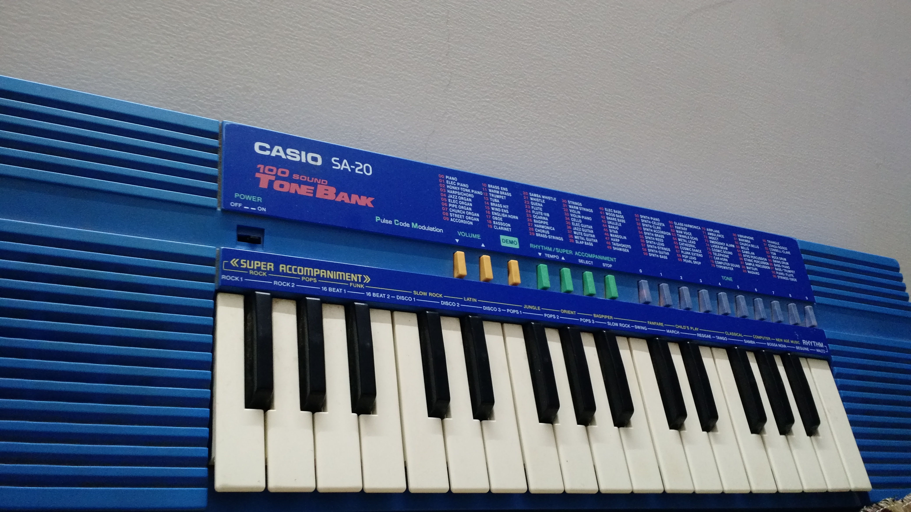
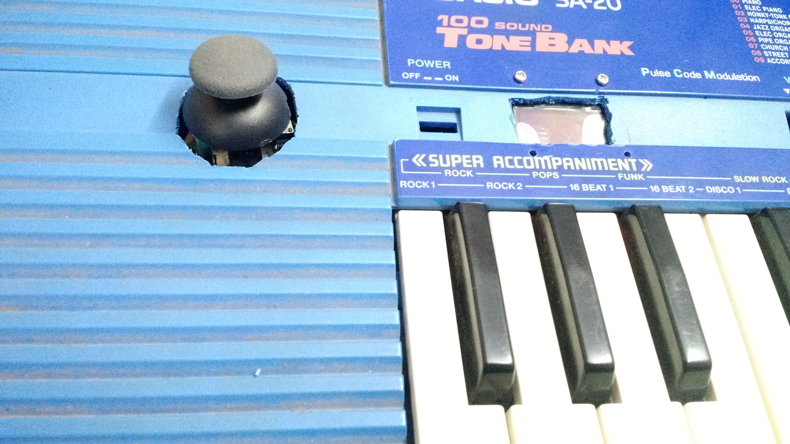

# midi-controller

Arduino interfacing with modified 32 key CASIO SA-20 keyboard to work as a MIDI controller

# Modifications in keyboard

- 8x4 key matrix scanned by Arduino using 4 GPIO for columns and 74HC595 shift register for columns
- PS2 analog joystick (2 analog axis + button) connected to arduino for [pitch bend](https://en.wikipedia.org/wiki/Pitch_wheel) (Up-Down) and MIDI program change (Left - Right)

# Schematics
To-Do

# Images

